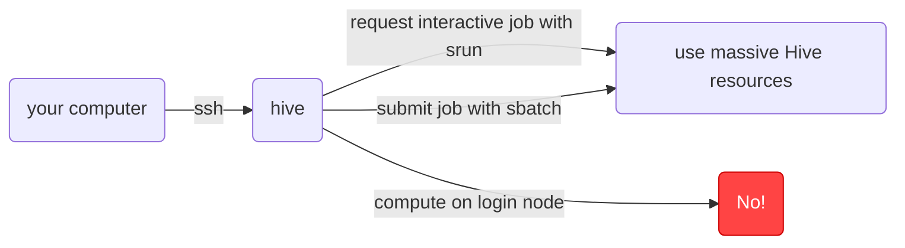

# 1. Getting started

## 1.1 Basic command line info
Finish the [command line tutorial](https://labex.io/lesson/the-shell) on linuxjourney

## 1.2 Setting up a Hive account
Go to [HiPPO](https://hippo.ucdavis.edu/clusters) and make an account.

See [ssh_keys.md](./ssh_keys.md) for more information about setting up ssh keys

## 1.3 Logging in and navigating

Once you have made your account on [HiPPO](https://hippo.ucdavis.edu/clusters), you should be able to log into Hive. You username and password will be the same as your kerberos ID login credentials.

You can log into Hive by opening the terminal (command line) and typing in `ssh username@hive.hpc.ucdavis.edu`. If you have set up an ssh key, you won't need to enter a password. When you first log in, you will be sent to `/home/zjamal`

```sh
# from your computer
ssh username@hive.hpc.ucdavis.edu

# enter password if prompted
# expository hive text will be printed

pwd
# /home/username
```

You can then move to your lab's directory

```sh
cd /quobyte/pi_namegrp
```

# 2. Doing things

Hive is an HPC that gives you access to a wealth of computational resources. Currently, the `genome-center-grp` has
- 616 CPUs
- 9,856 Gb RAM

On the `gpu-a100` partition, we have
- 128 CPUs
- 2,000 Gb RAM
- 8 GPUs

At any give time, you are limited to
- 64 CPUs
- 1,024 Gb RAM

## 2.1 Using software

While Hive has software built in that you can access with `module load`, we recommend against this. Relying on in-built modules makes it harder for others (and you!) to reproduce your work. People working on other computer systems may not have the exact software version on their cluster, so using `module load` may not always function as expected. Instead, we recommend using conda

See [conda_envs.md](./conda_envs.md) for information.

## 2.2 Using extensive hive resources



See [slurm_jobs.md](./slurm_jobs.md) for more information about requesting interactive jobs or submitting jobs.
